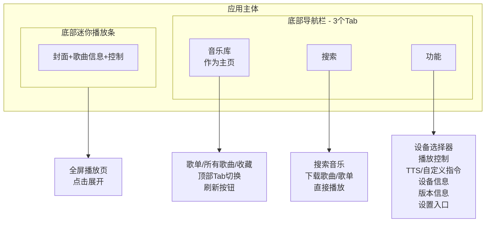
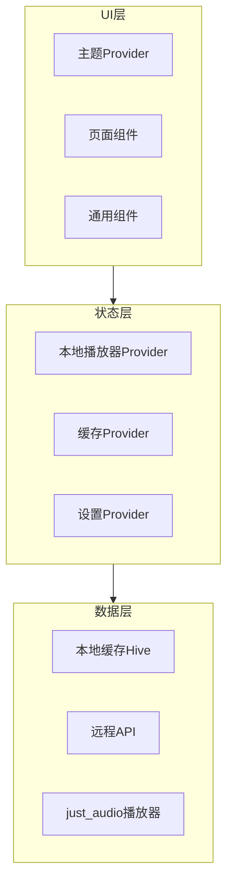

# 小米音乐 App 第二阶段开发计划

## 一、整体布局方案

### 应用结构




### 页面说明

| Tab | 名称 | 内容 ||-----|------|------|| 1 | **音乐库** (主页) | 顶部 Tab 切换： 所有歌曲(搜索默认搜全部歌曲) /歌单只展示歌单名称,点击进去可以可以看歌单内的歌曲/ 收藏，手动下拉刷新功能 || 2 | **搜索** | 搜索音乐 + 下载歌曲/歌单 + 直接搜索播放 || 3 | **功能** | 设备选择、播放控制、TTS、自定义指令、设备信息、版本信息、**设置入口** |

### 额外组件

- **底部迷你播放条**: 悬浮在导航栏上方，显示当前播放歌曲，点击展开全屏播放页
- **全屏播放页**: 大封面 + 歌词 + 完整播放控制 + 播放队列

## 二、架构概览




## 三、核心功能模块

### 1. 布局重构

**目标**: 3Tab (音乐库/搜索/功能) + 底部迷你播放条**关键改动**:

- 删除原首页 `dashboard_page.dart`，音乐库作为默认主页
- 重构 `scaffold_with_nav.dart` - 3 个导航项
- 新建 `lib/presentation/pages/functions/functions_page.dart` - 功能页
- 新建 `lib/presentation/pages/search/search_page.dart` - 搜索页
- 重构 `lib/presentation/pages/library/library_page.dart` - 融合音乐库
- 新建 `lib/presentation/widgets/mini_player.dart` - 迷你播放条
- 新建 `lib/presentation/pages/player/full_player_page.dart` - 全屏播放页

**音乐库页面内部结构**:

```javascript
音乐库 (TabBarView)
├── 歌单 Tab - 显示所有歌单列表，点击进入歌单详情
├── 所有歌曲 Tab - 显示全部歌曲列表
└── 收藏 Tab - 显示收藏的歌曲
```

**功能页面内部结构**:

```javascript
功能页
├── 设备选择卡片 (选择小米音箱)
├── 播放控制卡片 (播放/暂停/上一首/下一首/音量)
├── 快捷操作卡片 (TTS、自定义指令)
├── 设备信息卡片 (当前设备名称、硬件型号等)
├── 版本信息卡片 (后端版本)
└── 设置入口卡片 (进入分类设置页)
```


### 2. 搜索页 (新增下载功能)

**功能**:

- 搜索本地缓存的音乐
- 支持下载单曲 (`/downloadonemusic`)
- 支持下载歌单 (`/downloadplaylist`)
- 搜索结果直接点击播放

### 3. 主题系统

**目标**: 音乐 App 风格 + 深色/浅色模式支持**关键文件**:

- 新建 `lib/core/theme/app_theme.dart` - 主题定义
- 新建 `lib/core/theme/app_colors.dart` - 颜色常量
- 新建 `lib/data/providers/theme_provider.dart` - 主题状态管理
- 修改 `main.dart` - 集成主题切换

**主题配色方案**:

- 主色调: 渐变紫蓝色 (#6366F1 -> #8B5CF6)
- 强调色: 玫瑰粉 (#F472B6)
- 浅色模式: 浅灰白背景 (#F8FAFC) + 深色文字
- 深色模式: 深灰黑背景 (#0F172A) + 浅色文字 + 专辑封面模糊效果

### 4. 本地播放器

**目标**: 使用 just_audio 在本地设备播放远程音乐 URL**新增依赖**:

```yaml
just_audio: ^0.9.40
audio_service: ^0.18.15 # 后台播放支持
```

**关键文件**:

- 新建 `lib/data/providers/local_player_provider.dart`
- 新建 `lib/presentation/widgets/mini_player.dart` - 底部迷你播放条
- 新建 `lib/presentation/pages/player/full_player_page.dart` - 全屏播放页

**播放模式**:

- 远程模式: 发送指令到小米音箱播放 (现有功能)
- 本地模式: 获取音乐 URL 后在手机本地播放 (新增)

### 5. 缓存与本地搜索

**目标**: 缓存歌单列表，支持本地搜索，减少后端压力**新增依赖**:

```yaml
hive_flutter: ^1.1.0
hive: ^2.2.3
```

**关键文件**:

- 新建 `lib/data/cache/music_cache.dart`
- 新建 `lib/data/providers/cache_provider.dart`
- 修改 `music_provider.dart` - 本地搜索逻辑

**缓存策略**:

- App 启动时自动异步刷新歌单到本地
- 搜索时优先使用本地缓存进行模糊匹配
- 提供手动下拉刷新功能，强制同步最新数据
- 刷新时显示加载状态

### 6. 分类设置页面

**目标**: 参考用户提供的图片样式，左侧导航 + 右侧内容**结构设计**:

```javascript
设置
├── 账号设置 (服务器地址、用户名、密码)
├── 目录配置 (音乐路径、缓存路径、下载路径)
├── 服务配置 (端口、代理、HTTP认证)
├── 语音控制配置 (关键词、TTS设置)
├── 对话提示音配置 (播放模式提示语)
├── 外观设置 (主题切换、深色模式)
└── 关于 (版本信息、检查更新)
```

**关键文件**:

- 新建 `lib/presentation/pages/settings/settings_page.dart` - 主设置页(左右分栏)
- 新建 `lib/presentation/pages/settings/sections/` - 各分类设置组件
- 删除或重构原有 `login_page.dart`

### 7. 界面中文化

**目标**: 所有界面元素使用中文**中文文案对照**:

- Remote -> 首页
- Library -> 音乐库
- Playlists -> 歌单
- Search -> 搜索
- Functions -> 功能
- Settings -> 设置
- Play/Pause -> 播放/暂停
- Previous/Next -> 上一首/下一首
- Volume -> 音量
- Now Playing -> 正在播放
- Quick Actions -> 快捷操作
- Download -> 下载
- Device -> 设备

### 8. 交互优化

**目标**: 更丝滑的用户体验**改进点**:

- 迷你播放条上滑展开全屏播放页 (手势动画)
- 列表项添加 Shimmer 加载骨架屏
- 下拉刷新歌单列表
- 操作反馈 (SnackBar 优化样式)
- 播放状态实时更新 (进度条动画)
- 页面切换 Hero 动画 (封面图)

**新增依赖**:

```yaml
shimmer: ^3.0.0
cached_network_image: ^3.4.1 # 封面图缓存
```


## 四、文件结构规划

```javascript
lib/
├── core/
│   ├── theme/
│   │   ├── app_theme.dart          # 主题定义
│   │   └── app_colors.dart         # 颜色常量
│   ├── constants/
│   │   └── strings_zh.dart         # 中文字符串常量
│   └── utils/
│       └── debounce.dart           # 搜索防抖
├── data/
│   ├── cache/
│   │   └── music_cache.dart        # Hive缓存封装
│   ├── models/ (已有)
│   ├── network/ (已有)
│   └── providers/
│       ├── local_player_provider.dart  # 本地播放器
│       ├── cache_provider.dart         # 缓存管理
│       ├── theme_provider.dart         # 主题状态
│       └── ... (已有)
├── presentation/
│   ├── pages/
│   │   ├── library/
│   │   │   └── library_page.dart       # 音乐库(主页) - 歌单+歌曲+收藏
│   │   ├── search/
│   │   │   └── search_page.dart        # 搜索页 - 搜索+下载+播放
│   │   ├── functions/
│   │   │   └── functions_page.dart     # 功能页 - 设备控制+设置入口
│   │   ├── player/
│   │   │   └── full_player_page.dart   # 全屏播放页
│   │   ├── playlist/
│   │   │   └── playlist_detail_page.dart # 歌单详情(保留)
│   │   ├── settings/
│   │   │   ├── settings_page.dart      # 设置主页(左右分栏)
│   │   │   └── sections/
│   │   │       ├── account_section.dart
│   │   │       ├── directory_section.dart
│   │   │       ├── service_section.dart
│   │   │       ├── voice_section.dart
│   │   │       ├── dialog_section.dart
│   │   │       ├── appearance_section.dart
│   │   │       └── about_section.dart
│   │   └── scaffold_with_nav.dart      # 重构导航壳
│   └── widgets/
│       ├── mini_player.dart            # 底部迷你播放条
│       ├── shimmer_loading.dart        # 骨架屏加载
│       └── song_tile.dart              # 通用歌曲列表项
├── router.dart                         # 更新路由配置
└── main.dart                           # 集成主题
```


## 五、实施优先级

1. **P0 - 核心体验** (第一批)

- 布局重构 (3Tab + 迷你播放条)
- 主题系统 (深浅色切换)
- 界面中文化

2. **P1 - 重要功能** (第二批)

- 功能页面
- 分类设置页面
- 歌单缓存与本地搜索
- 搜索下载功能