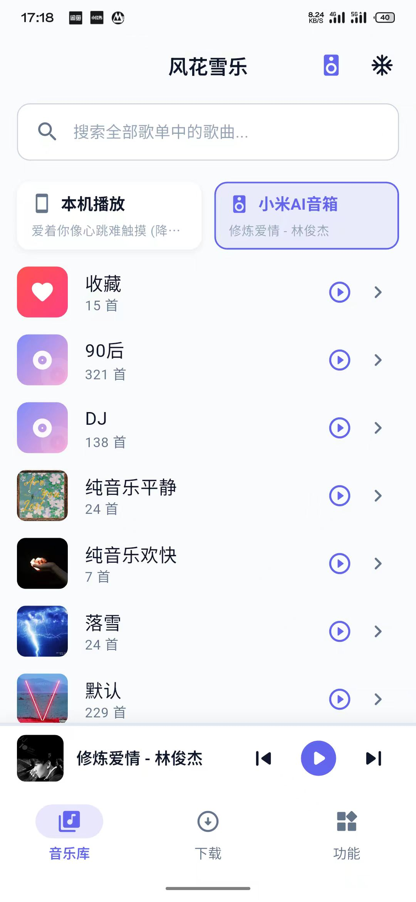
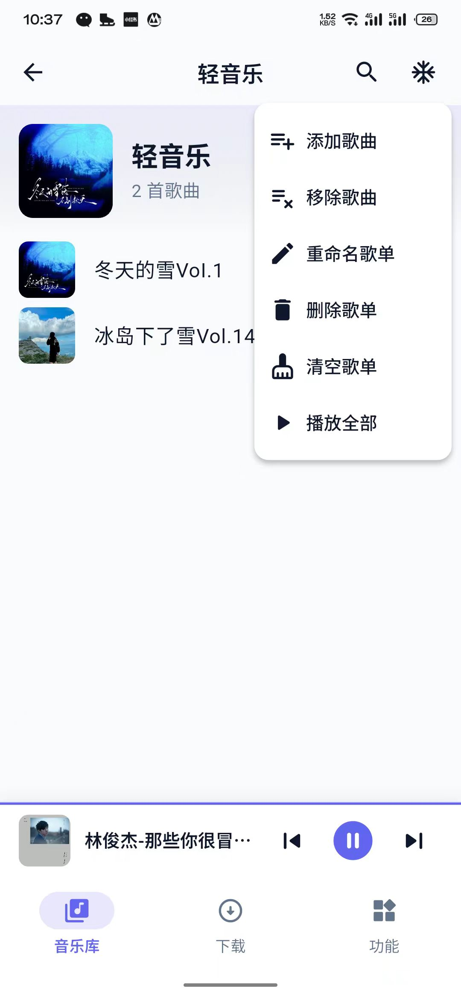
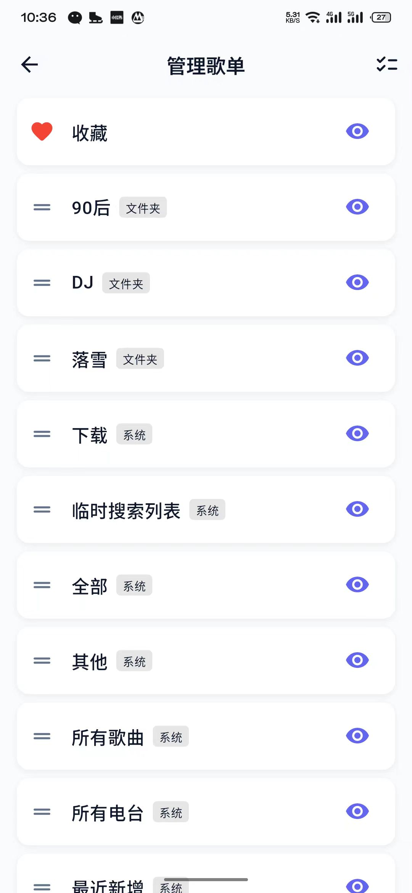
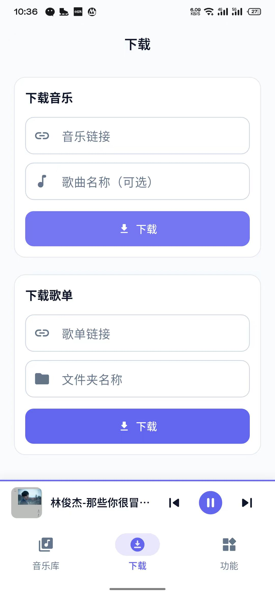
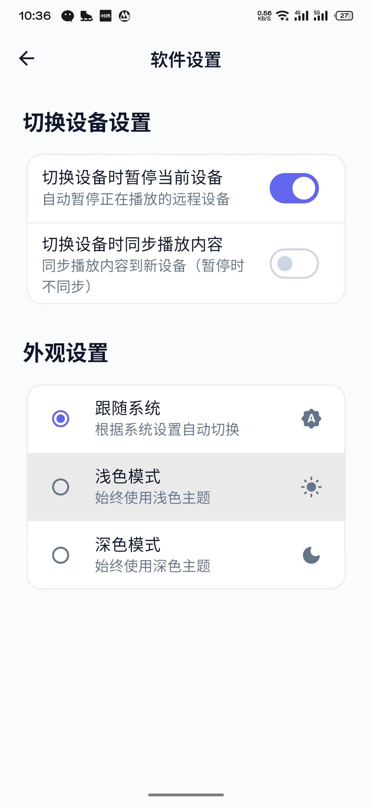
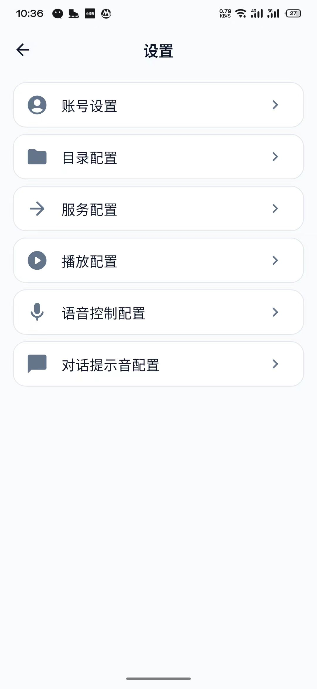

# 风花雪乐 (风花雪月)

一个支持 [xiaomusic](https://github.com/hanxi/xiaomusic) 的第三方 App，基于 Flutter 开发。

旨在为 xiaomusic 用户提供更流畅、原生的移动端体验。感谢 xiaomusic 让小爱音响再次伟大。

## 下载

- **Android**: [下载最新版本](https://github.com/jokezc/mi_music/releases/latest)
- **iOS**: [下载最新版本](https://github.com/jokezc/mi_music/releases/latest)
- **蓝奏云**: [下载最新版本](https://wwbts.lanzoue.com/b038zq3psf) (密码: 3rq9)

## ✨ 功能特性

### ✨ 核心亮点

- **📱 多端无缝连接**
  支持通过账号密码轻松连接 xiaomusic 服务端，实现设备互联。
- **🎵 专业音乐播放**
  提供完整的播放控制（播放/暂停、切歌、进度调节），支持循环与随机播放模式。
- **📡 多设备智能控制**
  自由选择在手机本地播放，或远程控制服务端连接的其他设备进行播放。支持首页快速切换设备，一键关闭所有设备，实时显示设备状态。
- **⚙️ 深度服务端管理**
  - **下载管理**：实时查看服务端下载进度与状态。
  - **智能定时任务**：便捷管理服务端的各类定时任务。
  - **设置中心**：支持目录、TTS、账号等丰富的服务端配置选项。
  - **快捷指令**：支持文本转语音、自定义指令等操作。

### 🎶 个性化与歌单管理

- **🎨 个性化体验**
  支持深色/浅色主题模式切换，适配不同使用环境。
- **📋 自定义歌单**
  支持创建、删除、重命名及清空歌单，支持批量选中进行隐藏、显示或删除操作。
- **✍️ 精细歌曲管理**
  随心向歌单添加歌曲、移除歌曲，或执行永久删除操作。
- **🔀 智能排序**
  支持长按拖拽，轻松调整歌单显示顺序。

## 📋 待开发功能

你们提 issue 吧截图之后描述清楚期望的效果和功能,我尽量做,有能力可以赞助哦,你们的支持才能让项目走的更远更好用.

## 🖼️ 效果展示

<!-- 电脑端一行三列等宽不错位，手机端一行一列；使用 flex + min-width 实现响应式，无需 media query -->
<div style="display: flex; flex-wrap: wrap; gap: 8px; box-sizing: border-box;">
  <div style="width: calc((100% - 16px) / 3); min-width: 260px; flex-shrink: 0; box-sizing: border-box;">
    <div style="width: 100%; height: 200px; overflow: hidden; background: #f5f5f5; border-radius: 8px;">
      
    </div>
    <div style="text-align: center; margin-top: 4px; font-size: 14px;">音乐库</div>
  </div>
  <div style="width: calc((100% - 16px) / 3); min-width: 260px; flex-shrink: 0; box-sizing: border-box;">
    <div style="width: 100%; height: 200px; overflow: hidden; background: #f5f5f5; border-radius: 8px;">
      
    </div>
    <div style="text-align: center; margin-top: 4px; font-size: 14px;">歌单详情</div>
  </div>
  <div style="width: calc((100% - 16px) / 3); min-width: 260px; flex-shrink: 0; box-sizing: border-box;">
    <div style="width: 100%; height: 200px; overflow: hidden; background: #f5f5f5; border-radius: 8px;">
      
    </div>
    <div style="text-align: center; margin-top: 4px; font-size: 14px;">歌单歌曲管理</div>
  </div>
  <div style="width: calc((100% - 16px) / 3); min-width: 260px; flex-shrink: 0; box-sizing: border-box;">
    <div style="width: 100%; height: 200px; overflow: hidden; background: #f5f5f5; border-radius: 8px;">
      
    </div>
    <div style="text-align: center; margin-top: 4px; font-size: 14px;">歌单管理</div>
  </div>
  <div style="width: calc((100% - 16px) / 3); min-width: 260px; flex-shrink: 0; box-sizing: border-box;">
    <div style="width: 100%; height: 200px; overflow: hidden; background: #f5f5f5; border-radius: 8px;">
      
    </div>
    <div style="text-align: center; margin-top: 4px; font-size: 14px;">播放页</div>
  </div>
  <div style="width: calc((100% - 16px) / 3); min-width: 260px; flex-shrink: 0; box-sizing: border-box;">
    <div style="width: 100%; height: 200px; overflow: hidden; background: #f5f5f5; border-radius: 8px;">
      
    </div>
    <div style="text-align: center; margin-top: 4px; font-size: 14px;">切换设备</div>
  </div>
  <div style="width: calc((100% - 16px) / 3); min-width: 260px; flex-shrink: 0; box-sizing: border-box;">
    <div style="width: 100%; height: 200px; overflow: hidden; background: #f5f5f5; border-radius: 8px;">
      
    </div>
    <div style="text-align: center; margin-top: 4px; font-size: 14px;">下载音乐</div>
  </div>
  <div style="width: calc((100% - 16px) / 3); min-width: 260px; flex-shrink: 0; box-sizing: border-box;">
    <div style="width: 100%; height: 200px; overflow: hidden; background: #f5f5f5; border-radius: 8px;">
      
    </div>
    <div style="text-align: center; margin-top: 4px; font-size: 14px;">功能界面</div>
  </div>
  <div style="width: calc((100% - 16px) / 3); min-width: 260px; flex-shrink: 0; box-sizing: border-box;">
    <div style="width: 100%; height: 200px; overflow: hidden; background: #f5f5f5; border-radius: 8px;">
      
    </div>
    <div style="text-align: center; margin-top: 4px; font-size: 14px;">软件设置</div>
  </div>
  <div style="width: calc((100% - 16px) / 3); min-width: 260px; flex-shrink: 0; box-sizing: border-box;">
    <div style="width: 100%; height: 200px; overflow: hidden; background: #f5f5f5; border-radius: 8px;">
      
    </div>
    <div style="text-align: center; margin-top: 4px; font-size: 14px;">系统设置</div>
  </div>
  <div style="width: calc((100% - 16px) / 3); min-width: 260px; flex-shrink: 0; box-sizing: border-box;">
    <div style="width: 100%; height: 200px; overflow: hidden; background: #f5f5f5; border-radius: 8px;">
      
    </div>
    <div style="text-align: center; margin-top: 4px; font-size: 14px;">关于</div>
  </div>
  <div style="width: calc((100% - 16px) / 3); min-width: 260px; flex-shrink: 0; box-sizing: border-box;">
    <div style="width: 100%; height: 200px; overflow: hidden; background: #f5f5f5; border-radius: 8px;">
      
    </div>
    <div style="text-align: center; margin-top: 4px; font-size: 14px;">登录</div>
  </div>
</div>

## 🛠 技术栈

本项目使用 Flutter 进行开发，主要使用了以下开源库和技术：

- **语言**: Dart 3.10.4
- **核心框架**: Flutter 3.38.5
- **状态管理**: [Riverpod](https://riverpod.dev/) (配合 riverpod_annotation 代码生成)
- **网络请求**: [Dio](https://pub.dev/packages/dio) + [Retrofit](https://pub.dev/packages/retrofit)
- **音频播放**: [just_audio](https://pub.dev/packages/just_audio) + [audio_service](https://pub.dev/packages/audio_service) (支持后台播放和控制中心)
- **路由管理**: [GoRouter](https://pub.dev/packages/go_router)
- **本地存储**: [Shared Preferences](https://pub.dev/packages/shared_preferences) & [Hive](https://pub.dev/packages/hive)
- **JSON 序列化**: [json_serializable](https://pub.dev/packages/json_serializable)
- **其他工具**:
  - `logger`: 日志打印
  - `permission_handler`: 权限处理
  - `flutter_launcher_icons`: 图标生成

## 📂 项目结构

```text
lib/
├── core/           # 核心基础代码 (常量、主题、工具类)
├── data/           # 数据层 (API、模型、缓存、Provider 实现)
├── presentation/   # 表现层 (页面、组件)
├── router.dart     # 路由配置
└── main.dart       # 入口文件
```

## 🚀 快速开始

如果你想自己编译或参与开发，请按照以下步骤操作。

### 1. 环境准备

确保你已经安装了 Flutter SDK 并配置好了开发环境（Android/iOS）。
检查环境状态：

```bash
flutter doctor
```

### 2. 获取代码与依赖

```bash
# 获取依赖
flutter pub get
```

### 3. 代码生成 (重要)

本项目使用了大量的代码生成工具（Riverpod, Retrofit, JSON 等），在运行前**必须**执行生成命令：

```bash
# 一次性生成
dart run build_runner build --delete-conflicting-outputs

# 或者使用 watch 模式（开发时推荐，自动监听文件变更）
dart run build_runner watch --delete-conflicting-outputs
```

### 4. 运行项目

连接设备或启动模拟器：

```bash
flutter run
```

### 5. 打包发布

**构建 APK (Android):**

```bash
# 构建发布版 APK
flutter build apk --release

# 如果需要针对不同 CPU 架构分包
flutter build apk --release --split-per-abi
```

**构建 iOS 包:**

```bash
cd ./ios

# 强制更新库定义，确保能下到作者新增的插件
pod install --repo-update

# 构建 iOS 发布版（生成 .app，可用于 Xcode 归档或真机运行）
flutter build ios --release

# 构建 IPA（用于 App Store 或 Ad Hoc 分发，需在 macOS 上且配置好签名）
flutter build ipa --release --export-method=development
```

## 🤝 贡献

欢迎提交 Issue 和 Pull Request！

## ❤️ 赞赏与支持

如果觉得这个项目对你有帮助，或者你喜欢我的工作，欢迎请我喝杯咖啡 ☕️。
你的支持是我持续维护和更新的动力！

|                微信支付                 |                  支付宝                  |
| :-------------------------------------: | :--------------------------------------: |
|  |  |

感谢每一位支持的朋友！
